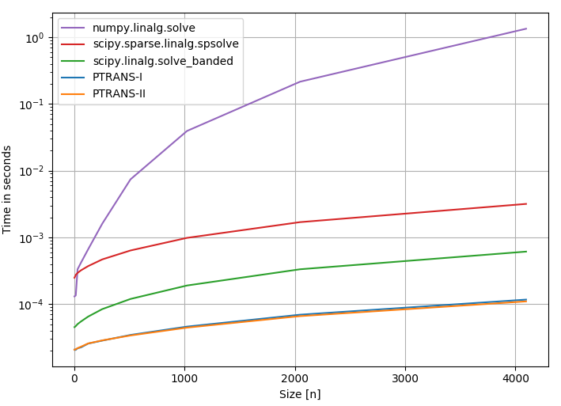

# Summary

Pentadiagonal linear systems of equations arise in many areas of science and engineering:
e.g., when solving differential equations, in interpolation problems, or in numerical schemes like finite differences.
A specific example is the radial symmetric groundwater flow equation with
consecutive rings of different constant transmissivity and radial boundary conditions,
which can be expressed as a pentadiagonal equation system [@avci_radial; @aquifer_test].

Pentadiagonal matrices are banded, being determined by their diagonal,
first and second upper minor-diagonals, as well as first and second lower minor-diagonals.
These matrices are sparse and can be stored efficiently in a flattened matrix with
$5n-6$ scalars.

A pentadiagonal linear system is given by the equation: $M\cdot X = Y$, where
$M$ is a banded quadratic $n\times n$ matrix of the form:

$$
M=\left(\begin{matrix}d_{1} & d_{1}^{\left(1\right)} & d_{1}^{\left(2\right)} & 0 & \cdots & \cdots & \cdots & \cdots & \cdots & 0\\
d_{2}^{\left(-1\right)} & d_{2} & d_{2}^{\left(1\right)} & d_{2}^{\left(2\right)} & 0 & \cdots & \cdots & \cdots & \cdots & 0\\
d_{3}^{\left(-2\right)} & d_{3}^{\left(-1\right)} & d_{3} & d_{3}^{\left(1\right)} & d_{3}^{\left(2\right)} & 0 & \cdots & \cdots & \cdots & 0\\
0 & d_{4}^{\left(-2\right)} & d_{4}^{\left(-1\right)} & d_{4} & d_{4}^{\left(1\right)} & d_{4}^{\left(2\right)} & 0 & \cdots & \cdots & 0\\
\vdots & \ddots & \ddots & \ddots & \ddots & \ddots & \ddots & \ddots & \ddots & \vdots\\
\vdots & \ddots & \ddots & \ddots & \ddots & \ddots & \ddots & \ddots & \ddots & \vdots\\
\vdots & \ddots & \ddots & \ddots & \ddots & \ddots & \ddots & \ddots & \ddots & \vdots\\
0 & \cdots & \cdots & \cdots & 0 & d_{n-2}^{\left(-2\right)} & d_{n-2}^{\left(-1\right)} & d_{n-2} & d_{n-2}^{\left(1\right)} & d_{n-2}^{\left(2\right)}\\
0 & \cdots & \cdots & \cdots & \cdots & 0 & d_{n-1}^{\left(-2\right)} & d_{n-1}^{\left(-1\right)} & d_{n-1} & d_{n-1}^{\left(1\right)}\\
0 & \cdots & \cdots & \cdots & \cdots & \cdots & 0 & d_{n}^{\left(-2\right)} & d_{n}^{\left(-1\right)} & d_{n}
\end{matrix}\right)
$$

Here, $d_i$ are the diagonal entries and $d_i^{(j)}$ represent the $j$-th minor diagonal.

Recently, @askar presented two algorithms to 
solve the linear systems of equations for $X$, ``PTRANS-I`` and ``PTRANS-II``, 
applying first transformation to a triangular matrix and then, respectively, backward and forward substitution.
``pentapy`` provides Cython [@cython] implementations of these
algorithms and a set of tools to convert matrices to row-wise or
column-wise flattened matrices and vice versa.

Since the algorithms have weak points,
for example when the first or last diagonal entry is zero,
``pentapy`` also provides interfaces to solvers from SciPy [@scipy],
like ``scipy.linalg.solve_banded`` (Lapack) and ``scipy.sparse.linalg.spsolve``.
The solver can be selected by a keyword argument.

The performance comparison in figure 1, done with ``perfplot`` [@perfplot], shows that the implementations
of ``pentapy`` are almost one order of magnitude faster than the SciPy algorithms for banded or sparse matrices.
The linear algebra solver of NumPy [@numpy] served as a standard reference, which disregards the special structure of the equation system.

``pentapy`` is designed to provide a fast solver for the special case of a
pentadiagonal linear system. To the best of the author's knowledge,
this package outperforms the current algorithms for solving pentadiagonal systems in Python.
The solver can handle different input formats of the coefficient matrix, i.e., a flattend matrix or a
quadratic matrix.

# Acknowledgements

I acknowledge the supervision by Prof.\ Sabine Attinger, Prof.\ Alraune Zech,
Prof. Peter Dietrich and Dr.\ Falk Heße and herewith want to thank them for
their trust and support.
I also want to thank Dr.\ Lennart Schüler for his constant help and the
pleasant partnership during the work on the GeoStat Framework.
This research was funded by the German Federal Environmental Foundation.

# References
